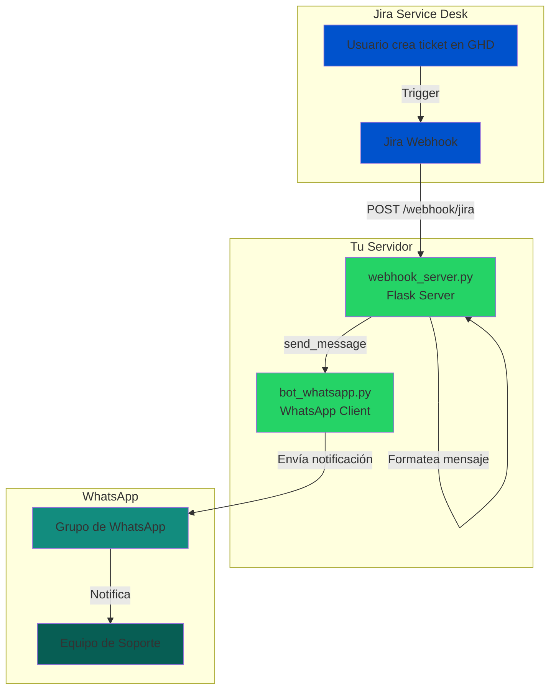

## Flujo de Datos

1. **Usuario crea ticket** en Jira Service Desk (proyecto GHD)
2. **Jira dispara webhook** con los datos del ticket
3. **Servidor Flask recibe** el webhook en `/webhook/jira`
4. **Servidor formatea** la información del ticket en un mensaje bonito
5. **Bot de WhatsApp envía** el mensaje al grupo configurado
6. **Equipo de soporte** recibe la notificación instantánea

## Formato del Mensaje

```
🎫 *Nuevo Ticket en Jira*

📋 *Incident:* GHD-123
📝 *Título:* Sistema no responde
👤 *Reportado por:* Juan Pérez
⚡ *Prioridad:* High

📄 *Descripción:*
El sistema presenta errores al intentar...

🔗 *Ver ticket:* https://integratelperu.atlassian.net/browse/GHD-123

⏰ *Creado:* 2026-01-05 01:30:00
```
